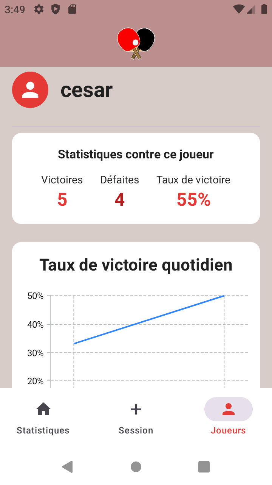

# PongStats

PongStats is an Android application designed to help table tennis players track and analyze their performance statistics. The app allows users to record match results for both singles and doubles games, providing insights into win rates and performance trends over time.

## Features

- **Match Recording**
  - Record singles and doubles matches
  - Track wins and losses
  - Store opponent information
  - Support for multiple sessions

- **Statistics**
  - Current win rate display for both singles and doubles
  - Daily win rate tracking
  - Visual performance trends through interactive charts
  - Separate statistics for singles and doubles matches

- **User Interface**
  - Clean, modern Material Design 3 interface
  - Intuitive navigation
  - Responsive layout
  - Dark/light theme support

## Screenshots

**Main Statistics Screen**



**Player Profile Screen**


## Technical Details

### Requirements
- Android 9.0 (API level 28) or higher
- Kotlin 1.8.0 or higher
- Android Studio Hedgehog or higher

### Dependencies
- Jetpack Compose for UI
- Room Database for local storage
- Vico Charts for statistics visualization
- Material 3 for theming
- Navigation Compose for navigation

### Architecture
- MVVM (Model-View-ViewModel) architecture
- Repository pattern for data management
- Use cases for business logic
- Kotlin Coroutines for asynchronous operations
- Flow for reactive programming

## Building the Project

1. Clone the repository
```bash
git clone https://github.com/yourusername/PongStats.git
```

2. Open the project in Android Studio

3. Sync the project with Gradle files

4. Build and run the application

## Versioning

The app follows semantic versioning:
- Major version: Incompatible API changes
- Minor version: Backwards-compatible functionality
- Patch version: Backwards-compatible bug fixes

## Contributing

1. Fork the repository
2. Create your feature branch (`git checkout -b feature/AmazingFeature`)
3. Commit your changes (`git commit -m 'Add some AmazingFeature'`)
4. Push to the branch (`git push origin feature/AmazingFeature`)
5. Open a Pull Request

## License

This project is licensed under the MIT License - see the LICENSE file for details.

## Acknowledgments

- Material Design 3 for the UI components
- Vico Charts for the statistics visualization
- Jetpack Compose team for the modern UI toolkit
