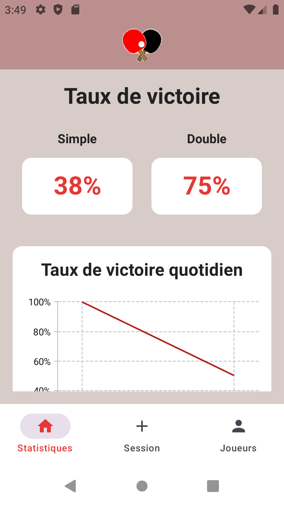

# PongStats

PongStats is an Android application I have written to collect data about my caual table tennis matches.
It also allows viewing evolution of performance through graphs. 
I started this project as an AI Assisted development experiment but then adandonned AI because I didn't like using the tools. 

## Screenshots

**Main Statistics Screen**

**Player Profile Screen**

## Dependencies
- kotlin >= 1.8.0
- Android 9.0 (API level 28) 
    
Why so old, you might wonder?
    I had to support my old phone

## Building the Project

The project is managed using gradle (https://gradle.org/).

## Versioning

The app follows semantic versioning:
- Major version: Incompatible API changes
- Minor version: Backwards-compatible functionality
- Patch version: Backwards-compatible bug fixes

## License

This project is licensed under the MIT License - see the LICENSE file for details.
